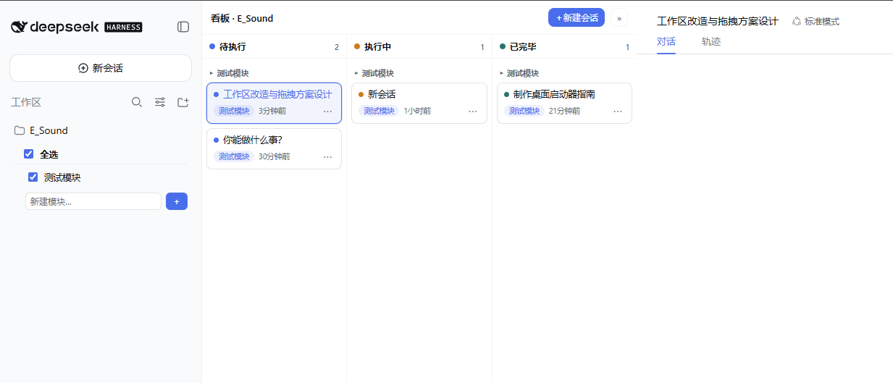

<p align="center">
  
</p>

# dsh-session-kanban · DSH 会话看板

A session kanban column for the [DeepSeek Harness](https://github.com/deepseek-ai/deepseek-harness) (dsh) Web UI — three scrollable lists (To-do / Doing / Done), per-project module filtering, drag & drop, and a one-click installer that patches the stock `dsh web` bundles.

为 DSH Web GUI 添加左侧“会话看板”列，附带一键安装 / 卸载 / 自检脚本，方便团队同步。

---

## English

### Features

- **Four-column layout**: `Projects | Kanban | Chat | Details` — the kanban sits to the right of the project list, resizable (480–760px), collapsible, auto-hidden on narrow screens.
- **Projects → module checkboxes**: projects no longer list sessions directly; expand a project to see its modules as checkbox rows (multi-select / select-all / create module), **single-project view**.
- **Three equal lists** (To-do / Doing / Done), each scrolls independently; sessions grouped by module, “Ungrouped” always visible.
- **Card actions**: full-row session title; click to open (highlighted when open); drag between lists (ghost + target highlight + drop hint + flash); the `⋯` menu supports **Rename / Fork / Archive** and module selection (closes on outside click or Esc).
- **Persistence**: status / module / filter stored in browser `localStorage` (`dsh.kanban.v1`), synced across tabs; session logs untouched.

```
Projects | Kanban (3 equal scrollable lists) | Chat | Details
 project │  To-do │ Doing │ Done
  ├ module│  card: status dot + title (full row)
  ├ check │        module chip / time / drag / ⋯ menu
  └ create│  · click opens · drag moves · ＋ new session
```

Interactive layout demo (pure HTML): [docs/example.html](docs/example.html)

### Compatibility

- Targets `@deepseek-ai/dsh` **0.1.0-rc.6** (Windows + Node.js). The installer verifies the local bundle version against pinned baselines and refuses on mismatch (use `-Force` at your own risk).
- Upgrading `@deepseek-ai/dsh` overwrites the patched bundles — re-run `install.cmd` to re-apply.

### Quick start

```powershell
# build the installer zip -> dist/dsh-session-kanban-installer.zip
npm run build:dist

# or run directly in the repo
powershell -NoProfile -ExecutionPolicy Bypass -File scripts/install.ps1 -Restart
# then refresh the browser (F5)
```

| Script | Purpose |
|---|---|
| `scripts/install.ps1` / `install.cmd` | one-click install (idempotent) |
| `scripts/uninstall.ps1` / `uninstall.cmd` | one-click uninstall |
| `scripts/verify.ps1` / `verify.cmd` | self-check install state |
| `scripts/restart.ps1` / `restart.cmd` | restart dsh web |

### How it works

See [docs/architecture.md](docs/architecture.md) — slot wiring, the `dsh.kanban.v1` storage contract, performance notes, and cross-version baseline regeneration.

### License & disclaimer

MIT (see [LICENSE](LICENSE)). This is a third-party modification of npm-installed `@deepseek-ai` bundles (MIT), not affiliated with DeepSeek. Installing rewrites files inside your local DSH installation tree; uninstall restores the pinned originals.

---

## 中文

### 功能特性

- **四栏布局**：`项目列表 | 看板 | 对话 | 详情`——看板列位于项目列表右侧，480–760px 可拖拽调宽、可折叠、窄屏自动隐藏。
- **项目（一级）→ 模块复选框（二级）**：项目不再直接平铺会话；展开项目勾选模块（多选 / 全选 / 新建模块），**单项目查看**，不跨项目合并模块。
- **三列看板**（待执行 / 执行中 / 已完毕）：各列等宽、独立滚动；会话按模块分组，「未分组」始终显示。
- **卡片操作**：会话名称独占整行；点击打开（打开后高亮）；拖拽换列（幽灵卡片 + 目标列高亮 + “松开以移动到…” + 落位闪烁）；`⋯` 菜单支持 **重命名 / 分叉 / 归档** 与模块选择，点外部或 Esc 即可关闭。
- **持久化**：状态 / 模块 / 筛选存浏览器 `localStorage`（`dsh.kanban.v1`），多标签页同步；不影响会话日志。

### 兼容性

- 目标版本 `@deepseek-ai/dsh` **0.1.0-rc.6**（Windows + Node.js）；安装脚本核验版本，不一致会明确提示（`-Force` 强制，风险自负）。
- 升级 dsh 会覆盖补丁 bundle，重跑 `install.cmd` 即可。

### 快速开始

```powershell
npm run build:dist   # 构建安装包 dist/dsh-session-kanban-installer.zip
# 或直接在仓库内执行
powershell -NoProfile -ExecutionPolicy Bypass -File scripts/install.ps1 -Restart
# 然后刷新浏览器（F5）
```

| 脚本 | 作用 |
|---|---|
| `scripts/install.ps1` / `install.cmd` | 一键安装（幂等） |
| `scripts/uninstall.ps1` / `uninstall.cmd` | 一键卸载，恢复原界面 |
| `scripts/verify.ps1` / `verify.cmd` | 自检安装状态 |
| `scripts/restart.ps1` / `restart.cmd` | 重启 dsh web |

### 工作原理

见 [docs/architecture.md](docs/architecture.md)：slot 接线、`dsh.kanban.v1` 存储契约、性能方案、跨版本重建基线步骤。

### 许可与免责声明

MIT（见 [LICENSE](LICENSE)）。本仓库是对 npm 安装的 `@deepseek-ai` 包（MIT）的第三方改造，与 DeepSeek 官方无关联。安装会改写本机 DSH 安装树；卸载脚本与原始基线可完整还原。

---

## 常见问题 / FAQ

| 现象 / Symptom | 处理 / Fix |
|---|---|
| 提示「版本不一致」 | 对齐 dsh 0.1.0-rc.6 后重装；或等维护者发布适配新版基线 |
| 提示「与基线均不匹配」 | `verify.ps1` 检查后 `install.ps1 -Force` |
| 安装后页面没变化 | 重启 dsh（配置行需重启）→ Ctrl+F5 → 看 `%TEMP%\dsh-kanban-web.err.log` |
| 看板空白 / 折叠后打不开 | 强制刷新；仍不行则 uninstall 后重装 |
| 升级 dsh 后失效 | 重跑 `install.cmd` |
